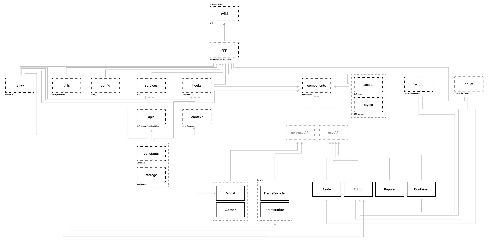
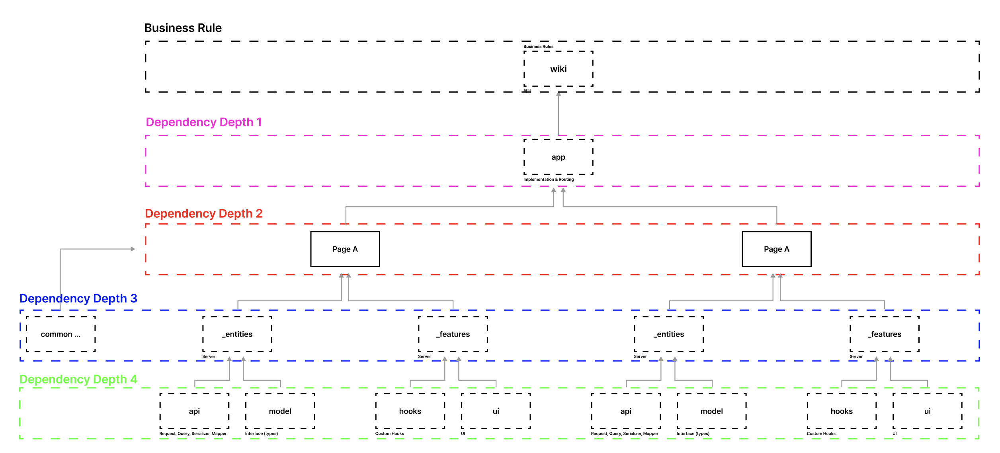

# Architecture

## AS IS

## TO BE

# TODO (new feature)

@5ewon @ubinquitous

- use Next.js v15
- use React.js v19
- use React Query v5
- use HydrationBoundary with hydrate fetch data
- use metadata, generateMetadata with JsonLD
- use FSD
- use Route Groups
- use Parallel Routes
- use Intercepting Routes (optional)
- use private folders
- use TypeScript v5 with 'use strict'
- use Skeleton UI
- use tailwindcss (optional)
- use 'use' (optional)
- use Partial pre-rendering (optional)
